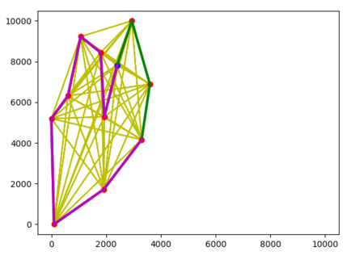

# Ant Colony Optimization


## Ambiente interativo
É possível encontrar um ambiente interativo [neste link](https://replit.com/@HeitorVentura/DTSP-ACO).

## Rodar localmente

1. Em primeiro lugar, é necessário possuir o `Python 3.x` e o gerenciador de pacotes `pip` instalado.
2. Em seguida, para instalar as dependências:
```console
$ pip install -r requirements.txt
```

2. Para rodar o programa, basta utilizar:
```console
$ python main.py
```